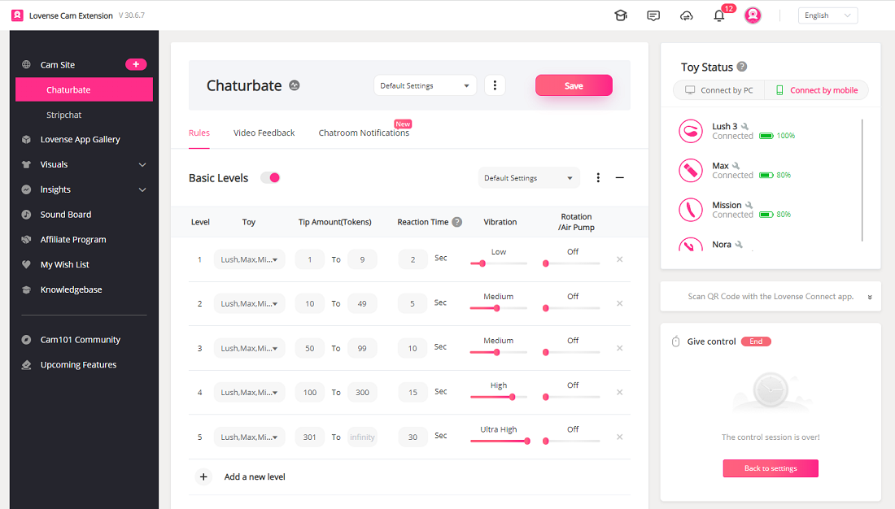

<RightMenu></RightMenu>
# Cam Extension for Chrome
<RightMenu></RightMenu>
The Cam Extension for Chrome is the best solution for cam models to stream with Lovense toys, featuring:

- Highly customizable vibration levels and patterns
- Lovense widget for quick access to settings while streaming
- Video overlay support for OBS, Streamster, SplitCam
- Games and tools to increase interactivity and earn more tips
- Frequent updates, improvements, and new features



## Step 1: Configure the developer dashboard

| Field                          | Description                                                                                                       |
| ------------------------------ | ----------------------------------------------------------------------------------------------------------------- |
| Website Name                   | The name that will be displayed in our cam site list (in the Cam Extension). Contact us if you want to change it. |
| Website URL                    | Your home page URL.                                                                                               |
| Model Broadcasting URL Pattern | The URL pattern of your model broadcasting page.                                                                  |
| Status                         | The status of your website.                                                                                       |

Go to the [developer dashboard](https://www.lovense.com/user/developer/info) and fill in your settings.

Status Meaning:

Pending - The website is being tested. Use `test:{Website Name}` name in order to add your website to the Cam Extension during the testing phase.

Active - The website is live and public. All models can see your cam site in the Cam Extension.

## Step 2: Integration

## Import the Javascript file

Import the Javascript file to your model’s broadcasting page. This Javascript will declare a global variable `CamExtension` on the page.

```html
<script src="https://api.lovense-api.com/cam-extension/static/js-sdk/broadcast.js"></script>
```

## Initialize the instance object

Initialize a CamExtension instance on the model’s live page.

```javascript
/**
 * @param {string} websiteName this is the Website Name shown in the developer dashboard
 * @param {string} modelName this is the model's name
 * @returns {object} CamExtension instance object
 */
const camExtension = new CamExtension(websiteName, modelName)
```

## Listen for ready event

Listen for the ready event, which will be called after successful initialization. You can communicate with the Cam Extension after this event is triggered.

```javascript
/**
 * readyCallback
 * @param {object} ce CamExtension instance object
 */
const readyCallback = function (ce) {
  // Handle the CamExtension instance object
  // e.g. await ce.getCamVersion()
}

camExtension.on("ready", readyCallback)
```

<!-- ::: warning Next
[I’m ready to test, what should I do now?](./faq.md#_2-i-m-ready-to-test-what-should-i-do-now)
::: -->

## Step 3: Methods & events

## Methods

- **receiveTip**

  Call this method when the model receives a tip. The Cam Extension will trigger a response in the toy according to these parameters:

  ```js
  /**
   * receiveTip
   * @param {number} amount  tip amount that the model receives
   * @param {string} tipperName this is the tipper’s Screen Name
   */
  camExtension.receiveTip(amount, tipperName)
  ```

- **receiveMessage**

  Call this method when the model receives a message in the chat room.

  ```js
  /**
   * receiveMessage
   * @param {string} userName  the sender’s Screen Name
   * @param {string} content the message just sent by the sender
   */
  camExtension.receiveMessage(userName, content)
  ```

- **getSettings**

  Get the model's Lovense Settings.

  ```js
  /**
   * getSettings
   * @returns {object} model's Lovense Settings
   */
  const data = await camExtension.getSettings()
  // data = {
  //  levels: {
  //    level1: {
  //     min: 1,
  //     max: 9,
  //     time: 2,
  //     rLevel: 0,
  //     vLevel: 0,
  //    },
  //    level2: {...}
  //    level3: {...}
  //  },
  //  special: {
  //    earthquake: {
  //      enable: true,
  //      type: "earthquake",
  //      time: "22",
  //      token: "120",
  //    },
  //    fireworks: (...),
  //    wave: (...),
  //    pulse: (...),
  //    random: (...),
  //    randomTime: (...),
  //    giveControl: (...),
  //    pause: (...),
  //    clear: (...),
  //  }
  // }
  ```

- **getToyStatus**

  Get the model's Lovense Toys status.

  ```js
  /**
   * getToyStatus
   * @returns {array} model's Lovense Toys status.
   */
  const data = await camExtension.getToyStatus()
  // data = [
  //  {
  //    id: "l58f167da065",
  //    name: "",
  //    type: "lush",
  //    status: "on"
  //  },
  //  {...}
  // ]
  ```

- **getCamVersion**

  Get the Cam Extension version.

  ```js
  /**
   * getCamVersion
   * @returns {string} Cam Extension version
   */
  const data = await camExtension.getCamVersion()
  // data = "30.4.4"
  ```

## Events

You can listen for certain events to get the latest real-time data

- **postMessage**

  We will trigger this event when we need to send a message to you or the chat room, and you will need to help us handle it accordingly.

  ```javascript
  camExtension.on("postMessage", (message) => {
    // Process the message to be sent
    // Send the message to chat room
    // e.g. message = "My LOVENSE Lush is now reacting to john's tip. It will stop after 5 sec!"
  })
  ```

- **toyStatusChange**

  We will trigger this event when the toy status changes.

  ```javascript
  camExtension.on("toyStatusChange", (data) => {
    // Handle toy information data
    // data = [{
    //  id: "d6c35fe83348",
    //  name: "toy's name",
    //  type: "lush",
    //  status: "on",
    //  version: "",
    //  battery: "80"
    // }]
  })
  ```

- **tipQueueChange**

  We will trigger this event when the tip queue updates.

  ```javascript
  camExtension.on("tipQueueChange", (data) => {
    //  handle queue information data
    //  data = {
    //   running: [
    //    {
    //      amount: 100,
    //      tipperName: "john",
    //      time: 20,
    //      module: "Special Command",
    //      cParameter: {},
    //      level: "",
    //      specialType: "earthquake",
    //      modelName: "coco",
    //      reactToys: [,
    //        toyId: "d6c35fe83348",
    //        specialType: "earthquake",
    //        status: 1,
    //        toyType: "lush",
    //      ]
    //    }
    //   ],
    //   queue: [...],
    //   waiting: [...]
    //  }
  })
  ```

- **settingsChange**

  We will trigger this event when the model’s Lovense Settings are updated.

  ```javascript
  camExtension.on("settingsChange", (data) => {
    //  handle configuration information data
    // data = {
    //  levels: {
    //    level1: {
    //     min: 1,
    //     max: 9,
    //     time: 2,
    //     rLevel: 0,
    //     vLevel: 0,
    //    },
    //    level2: {...}
    //    level3: {...}
    //  },
    //  special: {
    //    earthquake: {
    //      enable: true,
    //      time: "20",
    //      token: "100",
    //    },
    //    fireworks: (
    //      enable: true,
    //      time: "22",
    //      token: "120",
    //    ),
    //    giveControl: (
    //      enable: false,
    //      time: "",
    //      tokensBegin: "",
    //      tokensEnd: "",
    //    ),
    //    randomTime: (
    //      enable: true,
    //      tokens: "38",
    //      minTime: 10,
    //      maxTime: 50,
    //      level: 5,
    //    ),
    //    pause: (...),
    //    pulse: (...),
    //    random: (...),
    //    wave: (...),
    //  }
    // }
  })
  ```
