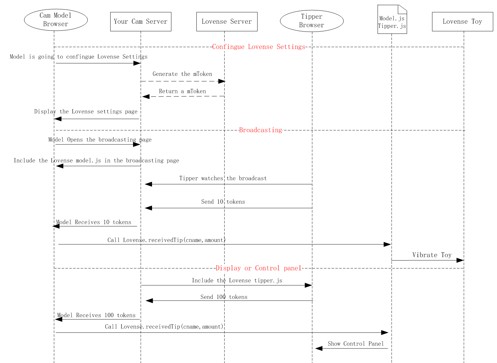

<RightMenu></RightMenu>
# Cam Kit for Web

## Work Flow

<!--  -->

<Mermaid :graph="`
sequenceDiagram
  participant M as Cam Model Browser
  participant DS as Your Cam Server
  participant T as Tipper Browser
  participant LS as Lovense Server
  participant J as Model.js
  participant LT as Lovense Toy
  rect
  note right of M: Configure Lovense Settings.
  M ->> DS:Model configures their Lovense settings
  DS ->> LS:Generate the mToken
  LS -->> DS:Return a m Token
  DS -->> M:Display the Lovense settings page
  end
  rect
  note right of M: Broadcasting
  M ->> DS:Model opens the broadcasting page
  DS ->> M:Include the Lovense model.js in the broadcasting page
  T ->> DS:Tipper watches the broadcast
  T ->> DS:Send 10 tokens
  DS ->> M:Model receives 10 tokens
  M ->> J:Call 'Lovense.receivedTip(cname, amount)'
  J ->> LT:Vibrate toy
  end
`" />

## Step 1: Configure the developer dashboard

Go to the [developer dashboard](https://www.lovense.com/user/developer/info)

1. Get your dToken (Developer Token).
2. Click "Cam Kit Developer settings (v2.0)", configure your settings.

## Step 2: Generate an mToken for your model

Get a unique token for your model. You only need to do this once for each model.

**API URL**: `https://api.lovense-api.com/api/cam/model/getToken`

> Notice: For security reasons, the developer token should be always used on the server side. You should never use it in your JS code from the client side.

**HTTP Request**: POST

**Content Type**: application/x-www-form-urlencoded; charset=UTF-8

**Parameters**:
| Name   | Description                                                                      |
| ------ | -------------------------------------------------------------------------------- |
| dToken | Developer Token                                                                  |
| mInfo  | Model's Information (UTF-8 encoded JSON), Format: {"mId": "xxx", "mName": "xxx"} |

**Sample request**:

<CodeGroup>
  <CodeGroupItem title="java">

```java
OkHttpClient client = new OkHttpClient().newBuilder()
  .build();
MediaType mediaType = MediaType.parse("application/x-www-form-urlencoded");
RequestBody body = RequestBody.create(mediaType, "dToken=xxx&mInfo={\"mId\":\"xxx\",\"mName\":\"xxx\"}");
Request request = new Request.Builder()
  .url("https://api.lovense-api.com/api/cam/model/getToken")
  .method("POST", body)
  .addHeader("User-Agent", "Mozilla/5.0 (Windows NT 10.0; Win64; x64) AppleWebKit/537.36 (KHTML, like Gecko) Chrome/92.0.4515.131 Safari/537.36")
  .addHeader("Content-Type", "application/x-www-form-urlencoded")
  .build();
Response response = client.newCall(request).execute();
```

  </CodeGroupItem>
  <CodeGroupItem title="javascript">

```js
var axios = require('axios');
var qs = require('qs');
var data = qs.stringify({
  'dToken': 'xxx',
  'mInfo': '{"mId":"xxx","mName":"xxx"}' 
});
var config = {
  method: 'post',
  url: 'https://api.lovense-api.com/api/cam/model/getToken',
  headers: { 
    'User-Agent': 'Mozilla/5.0 (Windows NT 10.0; Win64; x64) AppleWebKit/537.36 (KHTML, like Gecko) Chrome/92.0.4515.131 Safari/537.36', 
    'Content-Type': 'application/x-www-form-urlencoded'
  },
  data : data
};

axios(config)
.then(function (response) {
  console.log(JSON.stringify(response.data));
})
.catch(function (error) {
  console.log(error);
});
```

  </CodeGroupItem>
</CodeGroup>

**Return**:

```json
{
  "result": true, // true or false
  "message": "SuccessFully",
  "code": 200, // 200: OK 401: Invalid token 402: Invalid user information 505: Other Errors
  "data": {
    "mId": "xxx",
    "mToken": "95116bd2af44b753da2a1e4cd55cf965" // got mToken
  }
}
```

| Name    | Description                                                                   |
| ------- | ----------------------------------------------------------------------------- |
| result  | true if successful, false if failed                                           |
| message | Request result                                                                |
| data    | Detailed description                                                          |
| code    | 200: OK, 401: Invalid token, 402: Invalid user information, 505: Other Errors |

## Step 3: Model configures their Lovense settings

Display the Lovense settings page on the model's side. You can put this page in a new window or an iframe.

After you modify your settings, the new settings will take around 10 seconds to take effect.

**Settings page**: `https://api.lovense-api.com/api/cam/model/v2/setting?mToken={mToken}`

**Sample code**:

```js
lovense.settingPage = window.open(
  "https://api.lovense-api.com/api/cam/model/v2/setting?mToken={mToken}"
)
```

or

```html
<iframe
  id="lovense-setting"
  width="100%"
  height="1500px"
  scrolling="no"
  src="https://api.lovense-api.com/api/cam/model/v2/setting?mToken={mToken}"
></iframe>
```

## Step 4: Broadcasting process & methods

Include the model.js on your broadcasting page.

```html
<script src="https://api.lovense-api.com/api/cam/model/v2/model.js?mToken={mToken}"></script>
```

Call `lovense.addMessageListener(callback)` after the live page is loaded, and handle these types of messages in the callback function:

## Events

- **message**

  ```js
  lovense.addMessageListener(function (data) {
    // data = {
    //  type: "message",
    //  detail: "some customized messages to be sent to the public chat room."
    //  e.g. detail = "My LOVENSE Lush is now reacting to john's tip. It will stop after 5 sec!"
    //}
  })
  ```

- **settings**

  ```js
  lovense.addMessageListener(function (data) {
    // Handle settings information
    // data = {
    //  type: "settings",
    //  detail: {
    //   levels: {
    //     level1: {
    //      min: "1",
    //      max: "9",
    //      time: "2",
    //      rLevel: 0,
    //      vLevel: 0,
    //     },
    //     level2: {...}
    //     level3: {...}
    //   },
    //   special: {
    //     earthquake: {
    //       time: "22",
    //       token: "120",
    //     },
    //     fireworks: (...),
    //     giveControl: (...),
    //     pause: (...),
    //     pulse: (...),
    //     random: (...),
    //     twowaves: (...),
    //     wave: (...),
    //   }
    //  }
    // }
  })
  ```

- **toy**

  ```js
  lovense.addMessageListener(function (data) {
    // Handle toy information data
    // data = {
    //  type: "toy",
    //  status: "on"
    //  detail: [
    //   {
    //     id: "l58f167da065",
    //     name: "",
    //     type: "lush",
    //     status: "on"
    //   }
    //  ]
    // }
  })
  ```

- **tipQueueStatus**

  ```js
  lovense.addMessageListener(function (data) {
    // handle queue information data
    // data = {
    //  type: "tipQueueStatus",
    //  detail: {
    //   running: [
    //    {
    //      amount: 20,
    //      tipperName: "john",
    //      time: 30,
    //      cParameter: {},
    //      level: 5,
    //      module: "Basic Level"
    //      specialType: undefined,
    //      name: "coco",
    //      reactToys: [,
    //        toyId: "d6c35fe83348",
    //        specialType: "earthquake",
    //        status: 1,
    //        toyType: "lush",
    //        vibrate: 20,
    //        rotate: 0,
    //        airpump: 0,
    //      ]
    //    }
    //   ],
    //   queue: [
    //    {
    //      amount: 20,
    //      tipperName: "john",
    //    }
    //   ],
    //   waiting: [...]
    //  }
    // }
  })
  ```

- **tipRunning**

  ```js
  lovense.addMessageListener(function (data) {
    // handle running tip information
    // data = {
    //  type: "tipRunning",
    //  detail: {
    //   running: [
    //    {
    //      amount: 20,
    //      tipperName: "john",
    //      time: 30,
    //      cParameter: {},
    //      level: 5,
    //      module: "Basic Level"
    //      specialType: undefined,
    //      name: "coco",
    //      reactToys: [,
    //        toyId: "d6c35fe83348",
    //        specialType: "earthquake",
    //        status: 1,
    //        toyType: "lush",
    //        vibrate: 20,
    //        rotate: 0,
    //        airpump: 0,
    //      ]
    //    }
    //   ]
    //  }
    // }
  })
  ```

## Methods

- **initCamApi**

  If your website is a single page application, when the model enters the broadcasting page call `initCamApi`.

  ```js
  /**
   * initCamApi
   * @param {string} mToken  model token
   */
  lovense.initCamApi(mToken)
  ```

- **destroyCamApi**

  When the model ends the live broadcast or signs out, call `destroyCamApi`.

  ```js
  lovense.destroyCamApi()
  ```

- **receiveTip**

  Once a tip is received, call `Lovense.receiveTip(cname,amount)`. Toys will respond according to the settings.

  ```js
  /**
   * receiveTip
   * @param {string} cname  this is the tipper’s Screen Name
   * @param {number} amount  token amount
   */
  lovense.receiveTip(cname, amount)
  // e.g. lovense.receiveTip('cname', 1)
  ```

- **getToys**

  Use `getToys()` to get the toy info of models

  ```js
  /**
   * getToys
   * @returns {array} toy information
   */
  lovense.getToys()
  ```

  Return:

  ```json
  [
    {
      "id": "XXXXXXXXXXXX",
      "name": "",
      "status": "on",
      "type": "lush"
    }
  ]
  ```

- **getSettings**

  Use getSettings to get the settings info of models

  ```js
  /**
   * getSettings
   * @returns {object} settings information
   */
  lovense.getSettings()
  ```

  Return:

  ```js
  {
      levels: {
        level1: {
          max: 10, // tip level range maximum
          min: 3,  // tip level range minimum
          rLevel: 0, // rotation level
          time: 3, // duration (seconds)
          vLevel: 5  // vibration level
        },
        ...
      },
      special: {
        clear: {
          token: 20 // number of tokens
        },
        earthquake: (...),
        fireworks: (...),
        giveControl: (...),
        pause: (...),
        pulse: (...),
        random: (...),
        twowaves: (...),
        wave: (...)
      }
  }
  ```
