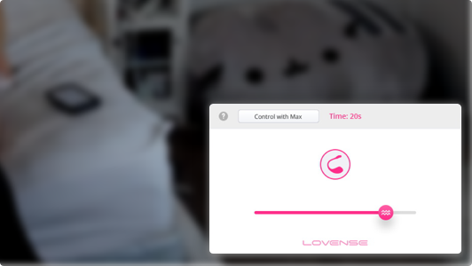
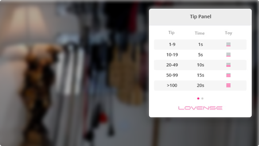
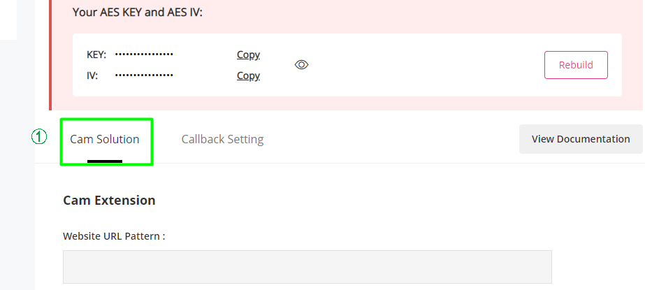
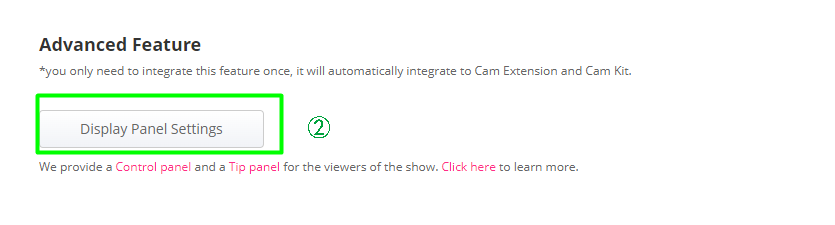
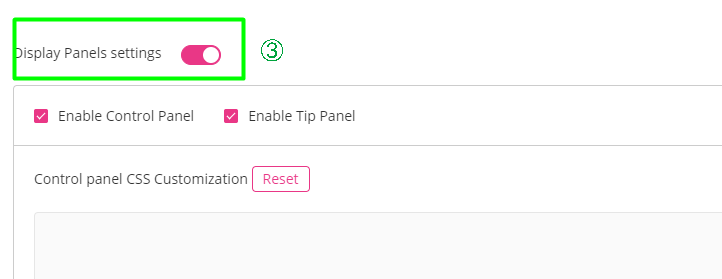
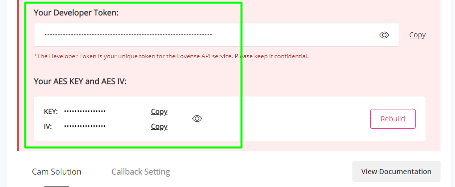
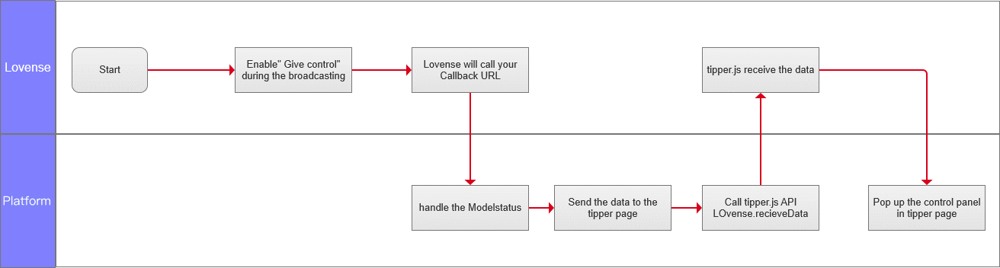

<RightMenu></RightMenu>
# Display Panel (optional)

The Lovense Display Panel makes the show much more interactive compared to simple text based tip activation. We currently provide 2 panels for your tippers/viewers.

- Control Panel - This enables a new tip menu item called Give Control. It automatically generates a control link for the tipper when they tip for this item, allowing models to give direct control of their toys to tippers much more easily.



- Tip Panel - Show the model's tip menu directly on the viewer's page.



> ⚠️This feature can only be used with [Cam Extension](cam-extension-for-chrome.md) or [Cam Kit](cam-kit-for-web.md)

## Step 1: Turn on the Display Panel on your Lovense Developer Dashboard

Go to the [developer dashboard](https://www.lovense.com/user/developer/info) and turn on the Display Panel.





You will get a default AES KEY and AES IV that are used for encryption. Use them to encrypt the model name and the tipper name.



## Step 2: Import the tipper.js to your tipper's page

```html
<script src="https://api.lovense-api.com/api/cam/tipper/v2/tipper.js"></script>
```

## Step 3: Initialize

```js
Lovense.init(platform, modelKey, tipperKey)
```

Parameters

| Name      | Description                                                                                                                                                                            | Required |
| --------- | -------------------------------------------------------------------------------------------------------------------------------------------------------------------------------------- | -------- |
| platform  | Your Website Name (shown in the Developer Dashboard)                                                                                                                                   | yes      |
| modelKey  | The model name encrypted on your server side using the AES KEY and AES IV. Do not expose your Key/IV in your JS code. (There is a demo on how to encrypt text using AES in JAVA below) | yes      |
| tipperKey | The tipper name encrypted using the AES KEY and AES IV (The tipper name should be the Display Name showing in the public broadcasting room)                                            | yes      |

> ⚠️ Display Panels are only available when the model is using Cam Extension version 30.0.8+

If your website is a single page application, when the tipper leaves the model's room, call:

```js
Lovense.destroy()
```

Here is the demo on how to encrypt text using AES in JAVA:

```java
import org.apache.commons.codec.binary.Base64;

import javax.crypto.Cipher;
import javax.crypto.spec.IvParameterSpec;
import javax.crypto.spec.SecretKeySpec;
import java.security.AlgorithmParameters;
import java.security.Key;

public class AESDemo {

    private static Key getKey(String key)  throws Exception{
        byte[] keyBytes = key.getBytes("UTF-8");
        SecretKeySpec newKey = new SecretKeySpec(keyBytes, "AES");
        return newKey;
    }
    private static AlgorithmParameters getIV(String iv) throws Exception {
        byte[] ivs = iv.getBytes("UTF-8");
        AlgorithmParameters params = AlgorithmParameters.getInstance("AES");
        params.init(new IvParameterSpec(ivs));
        return params;
    }

    public static String encrypt(String key,String iv,String text) throws Exception {

        Cipher cipher = Cipher.getInstance("AES/CBC/PKCS5Padding");
        cipher.init(Cipher.ENCRYPT_MODE, getKey(key), getIV(iv));
        byte[] encryptedBytes = cipher.doFinal(text.getBytes());
        return new String(Base64.encodeBase64(encryptedBytes, false,true),"UTF-8");
    }

    public static String decrypt(String key,String iv,String text) throws Exception {
        byte[] textBytes = Base64.decodeBase64(text);
        Cipher cipher = Cipher.getInstance("AES/CBC/PKCS5Padding");
        cipher.init(Cipher.DECRYPT_MODE, getKey(key), getIV(iv));
        byte[] decodedBytes = cipher.doFinal(textBytes);
        return new String(decodedBytes, "UTF-8");
    }

    public static void main(String[] args) throws Exception{
        String key="jHZZwiizsAF2qTAY";  //use your own Key here
        String iv="zijknVpNWeeTYGPV";  //use your own IV here
        String test="Hello World!";
        System.out.println(encrypt(key,iv,test));;
        System.out.println(decrypt(key,iv,encrypt(key,iv,test)));;
    }
}
```

## Step 4: Data Forwarding

Lovense will notify you when the Model Status has changed, and you should send the Model Status back to the tipper.js. Here is the Flow Chart:



**How does it work?**

Contact us to provide your callback URL. Lovense will post ModelStatus to your callback URL when necessary (for example, when the model enables/disables features during their broadcast). You forward the `ModelStatus` to the tipper/viewer's page and reply to the callback request with "OK". Then call `Lovense.recieveData(data)` on the tipper/viewer's page.

**Description of the Callback Request**

**URL**: `your callback url`

**Request Protocol**: HTTPS Request

**Method**: POST

**Content Type**: application/json

**the ModelStatus Object:**:

```json
{
  "from":"ABCDxxxxxxxxxxxx", //Encrypted String using your AES KEY and IV
  "to": {
    "type":"customersOfModel", //which group of people you should forward to
    "target":"Lucy,Tony" // users you should forward the data to
  },
  "data": data // the data you should forward
}
```

**Attributes in ModelStatus**

- `from` [String]: Encrypted string of "Lovense" using your AES KEY. If you can decrypt it with your AES KEY, you can confirm that the data is from Lovense. It is a static string until you changed your AES KEY in Lovense Dashboard.
- `to` [Object]: Whom you should forward the data to
- `to.type` [String]: Which group of people you should forward the data to. Possible values: `customersOfModel`, `customers`
- `to.target` [String]: Users you should forward to
  - If the `to.type` is `customersOfModel`, the `to.target` is the model's name (separated with commas if there are multiple values), and you should forward the data to all the customers in the specified model's broadcasting room.
  - If the `to.type` is `customer`, the `to.target` is the tipper/viewer's screen name (separated with commas if there are multiple values), and you should forward the data to the specified tipper/viewer
- `data` [String]: the data that you should forward

Here is a sample written in JAVA for handling the callback from Lovense:

```java
private final String KEY = "Your KEY";
private final String IV = "Your IV";
private final String AESFrom = AESUtil.encrypt("Lovense",KEY,IV);

@RequestMapping(value = "/lovense/callback")
public @ResponseBody String callback(@RequestBody Map<String,Object> modelStatus) {

  //1. If from is same as AESFrom
  if(AESFrom.equals(modelStatus.get("from"))){
    Map<String,String> to = (Map<String, String>) modelStatus.get("to");
    String data = (String) modelStatus.get("data");

    //2. Handle different target groups
    switch (to.get("type")){
      case "customersOfModel":
      String modelName = to.get("target");
      //3.1 TODO forward `data` to the tippers/viewers in the model's room
      break;
    case "customer":
      String customerScreenName = to.get("target");
      //TODO forward `data` to the tippers/viewers
      break;
    default:
      break;
    }
  }
  //4. Reply "OK"
  return "OK";
}
```
