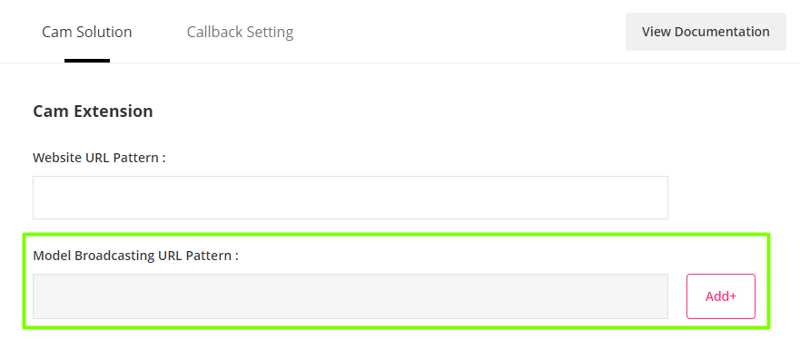
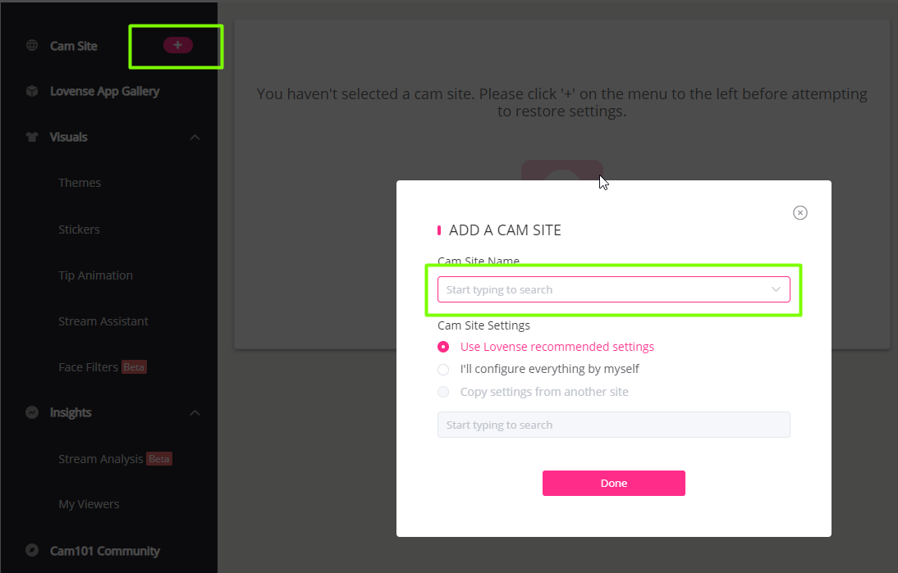
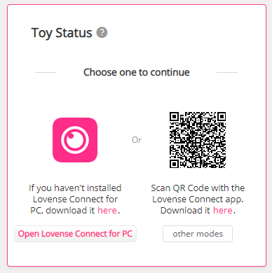
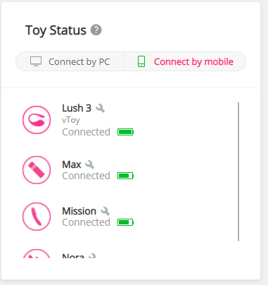
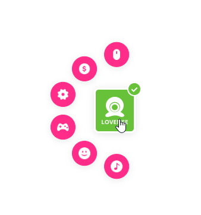

# FAQ

## Development

### 1. What integration method should I use for my service?

For a cam site or live streaming integration, use one of the Cam Solutions. Cam Extension for Chrome is the most popular as it provides a simple integration method and many great features for broadcasters.

For games or applications, use one of the Standard Solutions. The Standard API is for PC-based games or applications. The Standard JS API is for web-based games and applications.

To add Lovense features like toy connection directly into your app, check out our Native SDKs.

### 2. Do I need a Callback URL?

If you integrate with a solution other than the Cam Extension, yes. This allows you to receive status updates about your user's phone and connected toys, when they are using the Lovense Remote or Lovense Connect app.

### 3 What is "Heartbeat" used for in the Callback URL settings?

The heartbeat setting is how often we will send device/toy information to your Callback URL. The actual frequency may be slower than the heartbeat if your user is running the app in the background.

### 4. I don’t have or don’t use my own server. How can I do the integration?

If you don't have your own server, your users must use the Lovense desktop app or Lovense mobile app that is on the same local network as their computer.

## Cam Solutions

### 1. What’s the difference between the Cam Extension and Cam Kit?

Both options allow your models to use Lovense patented tip-activated vibrations. The main differences are in the amount of features and the setup method. For Cam Extension integration, models install our Cam Extension in the Chrome browser and set up their tip levels and other options inside the extension settings page. For Cam Kit integration, this embeds a more basic tip menu settings page on your website.

The Cam Extension includes more than 20 additional games and visual tools and is constantly being updated with new cool features. Cam Kit integration is more basic and mainly includes tip-activated vibrations.

### 2. I am ready to start testing my Cam Extension integration. What should I do?

Please follow the steps below to test the entire integration process (for Cam Extension integration only)

1. Go to your Lovense developer account dashboard and fill in "Model Broadcasting URL Pattern" under the "Cam Solution" column. Please fill in the model's live broadcast room URL according to the rules. For the specific format, please refer to [here](https://developer.chrome.com/docs/extensions/mv3/match_patterns/)

2. Install the Cam Extension on Chrome (or use the Lovense browser with built-in extension) and log in. Enter the settings page, add a live broadcast platform, and set up the tip rules.

Please note that when your integration is pending/in progress you need to use the prefix "test:" when adding your cam site in the extension settings page.

3. Install Lovense Connect for iOS/Android/PC/Mac and connect your toy. Establish a connection to the Cam Extension by either returning to the extension settings page and waiting a few seconds (PC/Mac Lovense Connect) or scanning the QR code on the settings page (iOS/Android Lovense Connect).

4. Start broadcasting from the model's broadcasting page. A Lovense widget will appear on this page if the integration was done correctly.

5. Use a tipper account to visit the live broadcast of your model test account from previous steps and send a tip to test the toy's reaction. If the toy reacts as expected, integration is complete!

### 3. I operate a cam site. How can I get my logo on the Lovense website?

Please [contact us](mailto:developer@mail.lovense.com) with more information about your cam site and integration method to discuss further.

### 4. How do my models use the Lovense Cam Extension?

Lovense has created several videu guides available here: <https://www.cam101.com/lovense/camming-download-guides>

Your models may also contact the Lovense support team at <https://www.lovense.com/contact> for further assistance.

### 5. Is there a developer mode for Lovense software?

Sorry, we do not currently offer a developer mode. A physical toy is required to test the connection and integration.

## Standard Solutions

### 1. I tried posting to `https://api.lovense-api.com/api/lan/getToys` with the user ID and my developer token as POST data. Why do I receive an empty JSON string in return?

The Lovense Remote app must be connected to the same network as the device calling the API.
