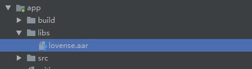
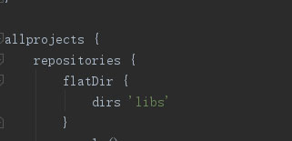

<RightMenu></RightMenu>
# Android SDK

The Lovense Android SDK is a set of application interfaces based on Android 4.3 and above. Use this SDK to develop applications for Android mobile devices. By calling the Lovense SDK interface, you can easily control Lovense toys and build applications with rich functions and strong interactivity.

<a :href="$withBase('/lovense-android-sdk-demo-1.1.0.zip')">Download Demo</a>

## Step 1: Get the developer token

Go to the [developer dashboard](https://www.lovense.com/user/developer/info) and get your developer token.

## Step 2: Download and extract the Lovense SDK

<a :href="$withBase('/lovense-android-sdk-1.1.0.zip')">Download SDK</a>

## Step 3: Include SDK and Configure

1. Copy the following file to your `libs` directory.

   

2. Add `lovense.arr` to your app build.gradle. Configure `libs` in the program build.gradle.

   **app build.gradle**:

   `implementation files ('libs/lovense.aar')`

   **program build.gradle**:

   

3. Configure permissions and register service in AndroidManifest.xml

   - Permission list

     ```xml
     <uses-permission android:name="android.permission.INTERNET" />
     <uses-permission android:name="android.permission.ACCESS_NETWORK_STATE"/>
     <uses-permission android:name="android.permission.BLUETOOTH" />
     <uses-permission android:name="android.permission.BLUETOOTH_ADMIN" />
     <uses-permission android:name="android.permission.ACCESS_COARSE_LOCATION" />
     <uses-permission android:name="android.permission.ACCESS_FINE_LOCATION" />
     ```

   - Register service

     ```xml
     <service android:name="com.xtremeprog.sdk.ble.BleService" android:enabled="true" />
     ```

## Step 4: Connect Lovense toys and send commands

```java

// Pass your token into the Lovense framework
Lovense.getInstance(getApplication()).setDeveloperToken("Your token");

// Add a scan success notification
Lovense.getInstance(getApplication()).searchToys(new OnSearchToyListener() {
  @Override
  public void onSearchToy(LovenseToy lovenseToy) { } // Find toys

  @Override
  public void finishSearch() { }  // Scan finish

  @Override
  public void onError(LovenseError msg) { } // error

});

//Add a connection success notification
Lovense.getInstance(getApplication()).connectToy(toyId, new OnConnectListener() {
  @Override
  public void onConnect(String toyId,String status) { // Toy connection status
    switch (status) {
      case LovenseToy.STATE_CONNECTING:
        break;
      case LovenseToy.STATE_CONNECTED:
        break;
      case LovenseToy.STATE_FAILED:
        break;
      case LovenseToy.SERVICE_DISCOVERED:
        break;
    }
  }
  @Override
  public void onError(LovenseError lovenseError) {} // Connection error
 });

// Add sending command notification
Lovense.getInstance(getApplication()).addListener(toyId, new OnCallBack() {});

// Search for the toys over Bluetooth
Lovense.getInstance(getApplication()).searchToys(new OnSearchToyListener());

//Stop searching for toys
Lovense.getInstance(getApplication()).stopSearching();

// Save the toys
Lovense.getInstance(getApplication()).saveToys(lovenseToys, new OnErrorListener());

// Retrieve the saved toys
Lovense.getInstance(getApplication()).listToys(new OnErrorListener());

// Connect the toy
Lovense.getInstance(getApplication()).connectToy(toyId,new OnConnectListener());

// Disconnect the toy
Lovense.getInstance(getApplication()).disconnect(toyId);

// Send a command to the toy
Lovense.getInstance(getApplication()).sendCommand(toyId,LovenseToy.COMMAND _VIBRATE,vibrateLevel);
```

## Command list

| Command                       | Description                                                                                                                 |
| ----------------------------- | --------------------------------------------------------------------------------------------------------------------------- |
| COMMAND_VIBRATE               | Vibrate the toy. The parameter must be between 0 and 20.                                                                    |
| COMMAND_ROTATE                | Rotate the toy. The parameter must be between 0 and 20.                                                                     |
| COMMAND_ROTATE_CLOCKWISE      | Rotate clockwise. The parameter must be between 0 and 20.                                                                   |
| COMMAND_ROTATE_ANTI_CLOCKWISE | Rotate anti-clockwise. The parameter must be between 0 and 20.                                                              |
| COMMAND_ROTATE_CHANGE         | Change the rotation direction                                                                                               |
| COMMAND_AIR_IN                | Airbag inflation for n seconds. The parameter must be between 1 and 3.                                                      |
| COMMAND_AIR_OUT               | Airbag deflation for n seconds. The parameter must be between 1 and 3.                                                      |
| COMMAND_AIR_AUTO              | Cycle airbag inflation for n seconds and air deflation for n seconds. The parameter must be between 0 and 3 (0 means stop). |
| COMMAND_VIBRATE1              | Activate the first vibrator at level n. The parameter must be between 0 and 20.                                             |
| COMMAND_VIBRATE2              | Activate the second vibrator at level n. The parameter must be between 0 and 20.                                            |
| COMMAND_VIBRATE_FLASH         | Vibrate the toy at level n and flash the light at the same time.                                                            |
| COMMAND_FLASH                 | Flash the light 3 times                                                                                                     |
| COMMAND_LIGHT_OFF             | Turn off the light (saved permanently).                                                                                     |
| COMMAND_LIGHT_ON              | Turn on the light (saved permanently).                                                                                      |
| COMMAND_GET_LIGHT_STATUS      | Get the light's status (1: on, 0: off)                                                                                      |
| COMMAND_ALIGHT_OFF            | Turn off Domi/Domi 2 light (saved permanently)                                                                              |
| COMMAND_ALIGHT_ON             | Turn on the Domi/Domi 2 light (saved permanently)                                                                           |
| COMMAND_GET_ALIGHT_STATUS     | Get the Domi/Domi 2 light status (1: on, 0: off)                                                                            |
| COMMAND_GET_BATTERY           | Get battery status                                                                                                          |
| COMMAND_GET_DEVICE_TYPE       | Get device/toy information                                                                                                  |
| COMMAND_START_MOVE            | Start tracking the toy movement (0-4)                                                                                       |
| COMMAND_STOP_MOVE             | Stop tracking the toy movement                                                                                              |
| COMMAND_PRESET                | Vibrate with a preset pattern. Patterns range from 1 to 10. n=0 will stop vibrations.                                       |

## Callback list

| Callback                         | Description                                     |
| -------------------------------- | ----------------------------------------------- |
| OnSearchToyListener              | Found toy list                                  |
| OnConnectListener                | Toy connected status                            |
| OnSendCommandErrorListener       | Send Command error, extends OnCallBack          |
| OnCallBackBatteryListener        | Battery status, extends OnCallBack              |
| OnCallBackDeviceTypListener      | Device information, extends OnCallBack          |
| OnCallBackLightStatusListener    | Light indicator, extends OnCallBack             |
| OnCallBackAidLightStatusListener | Domi/Domi 2 light indicator, extends OnCallBack |
| OnCallBackMoveListener           | Toy movement updates, extends OnCallBack        |
| OnCommandSuccessListener         | Command success, extends OnCallBack             |
| OnCommandErrorListener           | Command Error, extends OnCallBack               |
