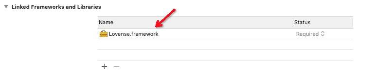

<RightMenu></RightMenu>
# iOS SDK

The Lovense iOS SDK is a set of application interfaces based on iOS 8.0 and above. Use this SDK to develop applications for iOS mobile devices. By calling the Lovense SDK interface, you can easily control Lovense toys and build applications with rich functions and strong interactivity.

<a :href="$withBase('/lovense-ios-sdk-demo-1.0.6.zip')">Download Demo</a>

## Step 1: Get your developer token

Go to the [developer dashboard](https://www.lovense.com/user/developer/info) and get your developer token.

## Step 2: Download and extract the Lovense SDK

<a :href="$withBase('/lovense-ios-sdk-1.0.6.zip')">Download SDK</a>

## Step 3: Include the SDK in your project

Copy the following files to your project main directory.

Add the required framework `Lovense.framework` to your project.



Configure environment: TARGETS -> General -> Deployment Info -> Deployment Target -> setting 8.0 or above.

## Step 4: Connect Lovense toys and send commands

<CodeGroup>
  <CodeGroupItem title="Object-C">

```js
// import Lovense
#import <Lovense/Lovense.h>

// Pass your token into the Lovense framework
[[Lovense  shared] setDeveloperToken:@"Your token"];

// Add a scan success notification
[[NSNotificationCenter defaultCenter] addObserver:self selector:@selector(scanSuccessCallback:)
name:kToyScanSuccessNotification object:nil];      //Scanning toy success notification
-(void)scanSuccessCallback:(NSNotification *)noti
{
    NSDictionary * dict = [noti object];
    NSArray <LovenseToy*>* toys = [dict objectForKey:@"scanToyArray"];
}

// Add a connect success notification

[[NSNotificationCenter defaultCenter] addObserver:self selector:@selector(connectSuccessCallback:)
name:kToyConnectSuccessNotification object:nil];     //Connected toy successfully notification
-(void)connectSuccessCallback:(NSNotification *)noti
{
    NSDictionary * dict = [noti object];
    LovenseToy * toy = [dict objectForKey:@"toy"];
    NSLog(@"%@",toy);
}

// Search for the toys over Bluetooth
[[Lovense  shared] searchToys];

// Save the toys
[[Lovense  shared] saveToys:toys];

// Retrieve the saved toys
NSArray<LovenseToy*> * listToys = [[Lovense  shared] listToys];

// Connect the toy
[[Lovense shared] connectToy:toyId];

// Disconnect the toy
[[Lovense shared] disconnectToy:toyId];

// Send a command to the toy
[[LovenseBluetoothManager shared] sendCommandWithToyId:toyId
andCommandType:COMMAND_VIBRATE andParamDict:@{kSendCommandParamKey
_VibrateLevel:@(20)}];

```

  </CodeGroupItem>
  <CodeGroupItem title="Swift">

```swift
Create YourProjectName-Bridging-Header.h

// Import Lovense
#import <Lovense/Lovense.h>

// Pass your token into Lovense framework
Lovense.shared().setDeveloperToken("token")

//Add a scan success notification
NotificationCenter.default.addObserver(self, selector: #selector(scanSuccessCallback),
name: NSNotification.Name(rawValue: kToyScanSuccessNotification), object: nil)
//Scanning toy success notification
@objc func scanSuccessCallback(nofi : Notification)
{
    let dict = nofi.object as? [String, LovenseToy]
    let scanToyArr = dict?["scanToyArray"]
}

//Add a connect success notification
NotificationCenter.default.addObserver(self, selector: #selector(connectSuccessCallback),
name: NSNotification.Name(rawValue: kToyConnectSuccessNotification), object: nil)
//Connected toy successfully notification
@objc func connectSuccessCallback(nofi : Notification)
{
    let dict = nofi.object as? [LovenseToy]
    let toy = dict?["toy"]
}

// Search the toys over Bluetooth
Lovense.shared().searchToys()

//Save the toys
Lovense.shared().save(toys)


// Retrieve the saved toys
Lovense.shared().listToys()

// Connect the toy
Lovense.shared().connectToy("toyId")

// Disconnect the toy
Lovense.shared().disconnectToy("toyId")

// Send a command to the toy
Lovense.shared().sendCommand(withToyId: "ToyId",
andCommandType: COMMAND_VIBRATE,
andParamDict: [kSendCommandParamKey_VibrateLevel:20])
```

  </CodeGroupItem>
</CodeGroup>

## Command list

| Command                       | Description                                                                                                                 |
| ----------------------------- | --------------------------------------------------------------------------------------------------------------------------- |
| COMMAND_VIBRATE               | Vibrate the toy. The parameter must be between 0 and 20.                                                                    |
| COMMAND_ROTATE                | Rotate the toy. The parameter must be between 0 and 20.                                                                     |
| COMMAND_ROTATE_CLOCKWISE      | Rotate clockwise. The parameter must be between 0 and 20.                                                                   |
| COMMAND_ROTATE_ANTI_CLOCKWISE | Rotate anti-clockwise. The parameter must be between 0 and 20.                                                              |
| COMMAND_ROTATE_CHANGE         | Change the rotation direction                                                                                               |
| COMMAND_AIR_IN                | Airbag inflation for n seconds. The parameter must be between 1 and 3.                                                      |
| COMMAND_AIR_OUT               | Airbag deflation for n seconds. The parameter must be between 1 and 3.                                                      |
| COMMAND_AIR_AUTO              | Cycle airbag inflation for n seconds and air deflation for n seconds. The parameter must be between 0 and 3 (0 means stop). |
| COMMAND_VIBRATE1              | Activate the first vibrator at level n. The parameter must be between 0 and 20.                                             |
| COMMAND_VIBRATE2              | Activate the second vibrator at level n. The parameter must be between 0 and 20.                                            |
| COMMAND_VIBRATE_FLASH         | Vibrate the toy at level n and flash the light at the same time.                                                            |
| COMMAND_FLASH                 | Flash the light 3 times                                                                                                     |
| COMMAND_LIGHT_OFF             | Turn off the light (saved permanently).                                                                                     |
| COMMAND_LIGHT_ON              | Turn on the light (saved permanently).                                                                                      |
| COMMAND_GET_LIGHT_STATUS      | Get the light's status (1: on, 0: off)                                                                                      |
| COMMAND_ALIGHT_OFF            | Turn off Domi/Domi 2 light (saved permanently)                                                                              |
| COMMAND_ALIGHT_ON             | Turn on the Domi/Domi 2 light (saved permanently)                                                                           |
| COMMAND_GET_ALIGHT_STATUS     | Get the Domi/Domi 2 light status (1: on, 0: off)                                                                            |
| COMMAND_GET_BATTERY           | Get battery status                                                                                                          |
| COMMAND_GET_DEVICE_TYPE       | Get device/toy information                                                                                                  |
| COMMAND_START_MOVE            | Start tracking the toy movement (0-4)                                                                                       |
| COMMAND_STOP_MOVE             | Stop tracking the toy movement                                                                                              |
| COMMAND_PRESET                | Vibrate with a preset pattern. Patterns range from 1 to 10. n=0 will stop vibrations.                                       |

## Callback list

| Callback                                  | Description                 |
| ----------------------------------------- | --------------------------- |
| kToyScanSuccessNotification               | Found toys                  |
| kToyConnectSuccessNotification            | Toy connected               |
| kToyConnectFailNotification               | Failed to connect a toy     |
| kToyConnectBreakNotification              | Toy disconnection           |
| kToySendCommandErrorNotification          | Unknown command received    |
| kToyCallbackNotificationBattery           | Battery status              |
| kToyCallbackNotificationDeviceType        | Device information          |
| kToyCallbackNotificationGetLightStatus    | Light indicator             |
| kToyCallbackNotificationGetAidLightStatus | Domi/Domi 2 light indicator |
| kToyCallbackNotificationListenMove        | Toy movement updates        |
| kToyCommandCallbackNotificationAtSuccess  | Successful command          |
| kToyCommandCallbackNotificationAtError    | Command error               |
