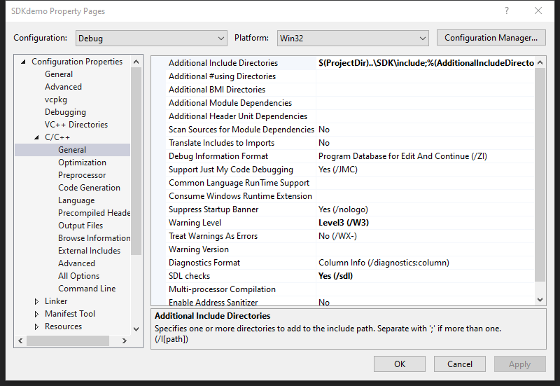
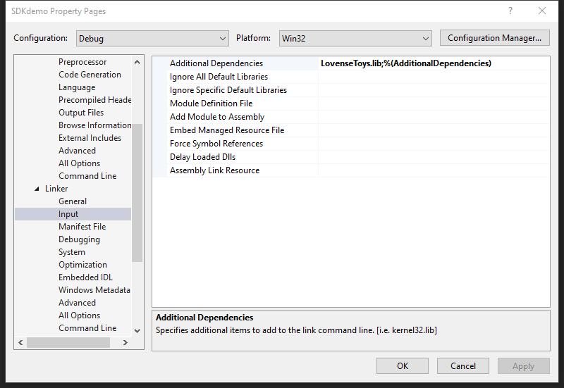
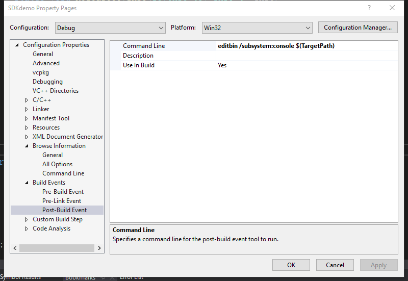

<RightMenu></RightMenu>
# Windows SDK

The Windows SDK is a library provided for Windows that allows you to directly access Lovense toys. You usually choose this option if you are making your own Windows application.

<a :href="$withBase('/lovense-win-sdk-demo-2.0.1.zip')">Download Demo</a>

## Step 1: Get your developer token

Go to the [developer dashboard](https://www.lovense.com/user/developer/info) and get your developer token.

> Note: You need to fill in your developer token when using the SDK.

## Step 2: Download SDK

<a :href="$withBase('/lovense-win-sdk-3.0.5.zip')">Download SDK</a>

## Step 3: Configure the SDK in your application

For example, the method below is to configure SDK in Visual Studio 2019

1. Set the path of the SDK header file

   

2. Set the path of SDK lib file

   

## Step 4: Connect Lovense toys and send commands

```c++
#include <Lovense.h>
...
class CEventCallBack: public ILovenseSDKNotify
{
	public:
		/*Call when toy search start*/
		virtual	void LovenseDidSearchStart();

		/*Call when toy searching toy*/
		virtual  void LovenseSearchingToys(lovense_toy_info_t *info) = 0;

		/*Call when something went wrong*/
		virtual  void LovenseErrorOutPut(int errorCode,const char *errorMsg) = 0;


		/*Call when toy search end*/
		virtual  void LovenseDidSearchEnd();

		/*Call when send cmd start*/
		virtual	void LovenseDidSendCmdStart();

		/*Call when send cmd return*/
		virtual  void LovenseSendCmdResult(const char * szToyID, CLovenseToy::CmdType cmd,const char *result,CLovenseToy::Error errorCode);

		/*Call when send cmd end*/
		virtual	void LovenseDidSendCmdEnd();

		/*Call when toy connected, or disconnected*/
		virtual void LovenseToyConnectedStatus(const char *szToyID, bool isConnected) ;
};

...
	//TODO:This is a simple process
	CEventCallBack *callBack = new CEventCallBack();
	CLovenseToyManager *manager = GetLovenseToyManager();
	manager->SetDeveloperToken(...);
	manager->RegisterEventCallBack(callBack);
	manager->StartSearchToy();//Search for the toys via USB Dongle
```

Send a command

```c++
	CLovenseToyManager *manager = GetLovenseToyManager();
	//Send a vibration command
	manager->SendCommand(toyID,CLovenseToy::CmdType::COMMAND_VIBRATE,10);

```

For a list of supported commands, check `LovenseDef.h`

```c++
namespace CLovenseToy
{
	typedef enum {

		/**
		-Power off!
		- param Key = no parameter
		*/
		COMMAND_POWER_OFF = 100,

		/**
		- Vibrate the toy. The parameter must be between 0 and 20!
		- Supported toys = all
		*/
		COMMAND_VIBRATE = 101,

		/**
		- Rotate the toy. The parameter must be between 0 and 20!
		- Supported toys = Nora
		*/
		COMMAND_ROTATE = 102,
		.
		.
		.
	}
}
```

## Setup

1. Insert the Lovense USB Bluetooth Adapter into the PC.
2. Turn on the toy. The light will begin flashing.
3. Open your application and search for the toy to establish a connection.

## Tips

1. When searching for toys, do not send other commands to toys.
2. If you need to get the toy's battery level frequently, start a thread loop.
3. For best results, don't sent toy commands more than once per second.
4. First time users, refer to our SDK Demo linked above.

## View log output

To view log output, use the editbin command.

> Note: If there is an "editbin not found" error when compiling, here is a [solution](https://stackoverflow.com/questions/57207503/dumpbin-exe-editbin-exe-package-needed-in-visual-studio-2019).



[developer dashboard]: https://www.lovense.com/user/developer/info
