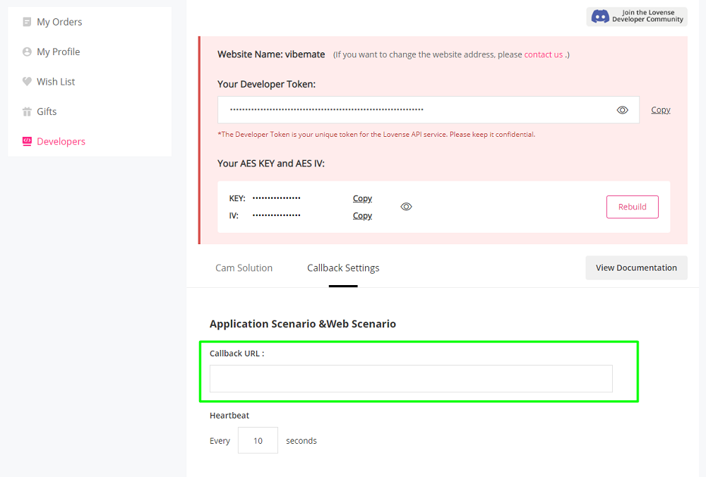
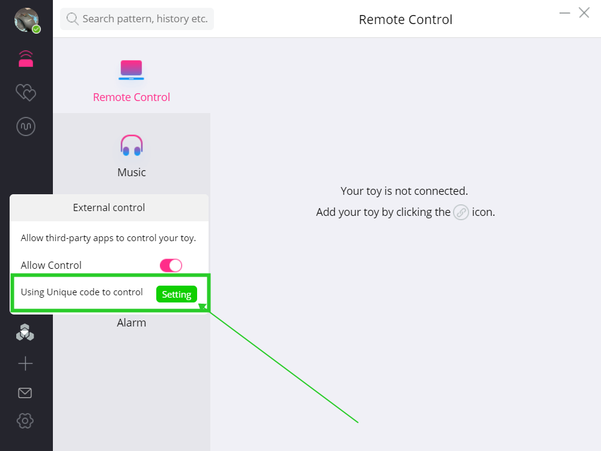
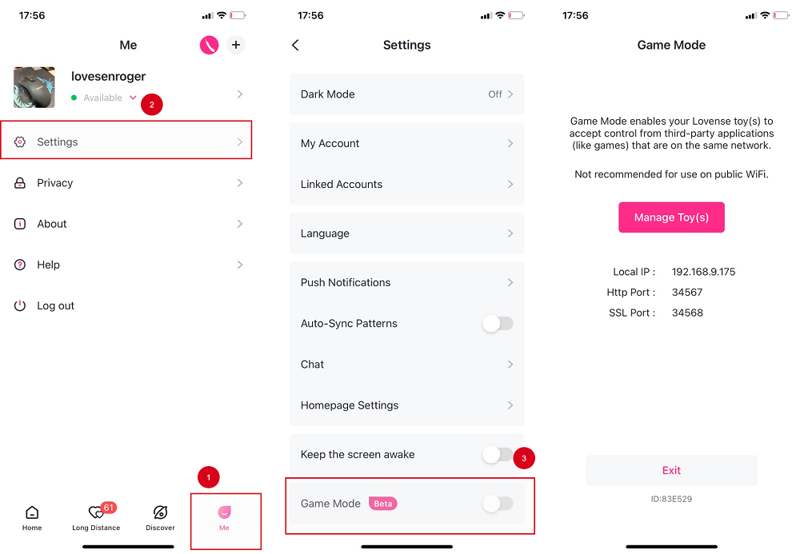
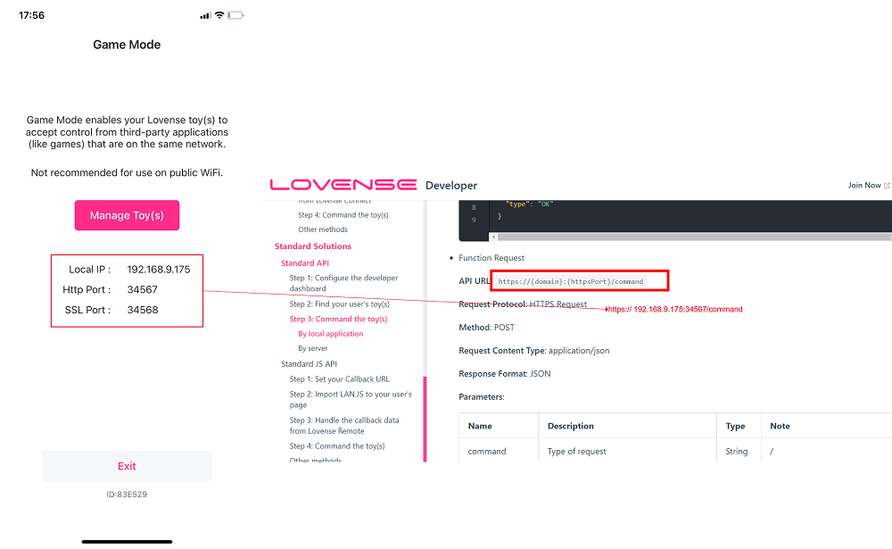

---
head:
  - [meta, { name: description , content: 'Lovense Developer: Standard solutions available on Google Play and the App Store to integrate Lovense Remote' }]

pageClass: docment-class-page
prev: false
next: false

---
<RightMenu></RightMenu>

# Standard API

This API allows any application to access its users Lovense toys from the developer side.

Here is a sample [demo](/lovense-basic-api-demo.zip) for your reference.

## Step 1: Configure the developer dashboard

Go to the [developer dashboard](https://www.lovense.com/user/developer/info) and set your Callback URL.



## Step 2: Find your user's toy(s)

<Mermaid :graph="`
sequenceDiagram
  actor Your User
  participant Your App
  participant Your Server
  participant Lovense Server
  participant Lovense Remote App
  participant Lovense Toy
  Your User ->> Lovense Remote App: Open Lovense Remote
  Your User ->> Lovense Toy: Turn on the toy
  Your User ->> Your App: User Logs in to your App
  Your App ->> Your Server: Request to bind with Lovense Toy
  Your Server ->>Lovense Server: Request QR code from Lovense
  Lovense Server -->>Your Server: Return a QR code URL
  Your Server ->>Your App: Display the QR code
  Your User ->>Lovense Remote App: User scans the QR code with Lovense Remote App
  Lovense Remote App ->>Your Server: Lovense Remote app will post to your server:
  Your App ->> Lovense Remote App: Control the toy by instructing the App
  Lovense Remote App ->> Lovense Toy:Trigger vibration
`" />

1. Get your developer token from the Lovense developer dashboard.

2. Your server calls Lovense server's API (use POST request)

   For example:

   <CodeGroup>
      <CodeGroupItem title="java">

   ```java
   String url= "https://api.lovense-api.com/api/lan/getQrCode";
   Map<String, String> requestParameter = new HashMap<String, String>();
   //TODO initialize your parameters:
   requestParameter.put("token", "{Lovense developer token}");
   requestParameter.put("uid", "{user ID on your website}");
   requestParameter.put("uname", "{user nickname on your website}");
   requestParameter.put("utoken", "{Encrypted user token on your application. This is a security consideration, to avoid others stealing control of the toy.}");
   requestParameter.put("v", 2);
   HttpPost httpPost = new HttpPost(url);
   List<NameValuePair> nameValuePairs = new ArrayList<NameValuePair>();
   if (requestParameter != null && !requestParameter.isEmpty()) {
     Set<String> keys = requestParameter.keySet();
     for (String key : keys) {
       nameValuePairs.add(new BasicNameValuePair(key, requestParameter.get(key)));
     }
   }
   httpPost.setEntity(new UrlEncodedFormEntity(nameValuePairs, "utf-8"));
   ```

      </CodeGroupItem>
      <CodeGroupItem title="Javascript">

   ```js
   const result = await axios.post(
     "https://api.lovense-api.com/api/lan/getQrCode",
     {
       token: "your developer token", // Lovense developer token
       uid: "11111", // user ID on your website
       uname: "user name", // user nickname on your website
       utoken: md5(uid + "salt"), // This is for your own verification purposes. We suggest you to generate a unique token/secret for each user. This allows you to verify the user and avoid others faking the calls.
       v: 2,
     }
   )
   ```

    </CodeGroupItem>
   </CodeGroup>

   You will get:

   ```json
   {
      code: 0
      message: "Success"
      result: true
      data: {
        "qr": "https://test2.lovense.com/UploadFiles/qr/20220106/xxx.jpg", // QR code picture
        "code": "xxxxxx"
      }
   }
   ```

3. Once the user scans the QR code with the Lovense Remote app, the app will invoke the Callback URL you've provided in the developer dashboard. The Lovense server is no longer required. All communications will go from the app to your server directly.

   The Lovense Remote app will send the following POST to your server:

   ```json
   {
     "uid": "xxx",
     "appVersion": "4.0.3",
     "toys": {
       "xxxx": {
         "nickName": "",
         "name": "max",
         "id": "xxxx",
         "status": 1
       }
     },
     "wssPort": "34568",
     "httpPort": "34567",
     "wsPort": "34567",
     "appType": "remote",
     "domain": "192-168-1-44.lovense.club",
     "utoken": "xxxxxx",
     "httpsPort": "34568",
     "version": "101",
     "platform": "android"
   }
   ```

## Step 3: Command the toy(s)

> Note: iOS Remote 5.1.4+, Android Remote 5.1.1+, or PC Remote 1.5.8+ is required.

### By local application

If the user's device is in the same LAN environment, a POST request to Lovense Remote can trigger a toy response. In this case, your server and Lovense's server are not required.

If the user uses the mobile version of Lovense Remote app, the `domain` and `httpsPort` are accessed from the callback information. If the user uses Lovense Remote for PC, the `domain` is `127-0-0-1.lovense.club`, and the `httpsPort` is `30010`

With the same command line, different parameters will lead to different results as below.

- GetToys Request

  Get the user's toy(s) information.

  **API URL**: `https://{domain}:{httpsPort}/command`

  **Request Protocol**: HTTPS Request

  **Method**: POST

  **Request Content Type**: application/json

  **Response Format**: JSON

  **Parameters**:

  | Name    | Description     | Type   | Note | Required |
  | ------- | --------------- | ------ | ---- | -------- |
  | command | Type of request | String | /    | yes      |

  **Request Example**:

  ```json
  {
    "command": "GetToys"
  }
  ```

  **Response Example**:

  ```json
  {
    "code": 200,
    "data": {
      "toys": "{  \"fc9f37e96593\" : {    \"id\" : \"fc9f37e96593\",    \"status\" : \"1\",    \"version\" : \"\",    \"name\" : \"nora\",    \"battery\" : 100,    \"nickName\" : \"\"  }}",
      "platform": "ios",
      "appType": "remote"
    },
    "type": "OK"
  }
  ```

- GetToyName Request

  Get the user's toy(s) name.

  **API URL**: `https://{domain}:{httpsPort}/command`

  **Request Protocol**: HTTPS Request

  **Method**: POST

  **Request Content Type**: application/json

  **Response Format**: JSON

  **Parameters**:

  | Name    | Description     | Type   | Note | Required |
  | ------- | --------------- | ------ | ---- | -------- |
  | command | Type of request | String | /    | yes      |

  **Request Example**:

  ```json
  {
    "command": "GetToyName"
  }
  ```

  **Response Example**:

  ```json
  {
    "code": 200,
    "data": [
      "Domi",
      "Nora"
    ],
    "type": "OK"
  }
  ```

- Function Request

  **API URL**: `https://{domain}:{httpsPort}/command`

  **Request Protocol**: HTTPS Request

  **Method**: POST

  **Request Content Type**: application/json

  **Response Format**: JSON

  **Parameters**:

  | Name           | Description                                             | Type   | Note                                                                                                                                                                                                                                                                                                                                       | Required |
  | -------------- | ------------------------------------------------------- | ------ | ------------------------------------------------------------------------------------------------------------------------------------------------------------------------------------------------------------------------------------------------------------------------------------------------------------------------------------------ | -------- |
  | command        | Type of request                                         | String | /                                                                                                                                                                                                                                                                                                                                          | yes      |
  | action         | Control the function and strength of the toy            | string | Actions can be Vibrate, Rotate, Pump, Thrusting, Fingering, Suction or Stop. Use All to make all functions respond. Use Stop to stop the toy’s response. <br> Range: <br> `Vibrate`:`0` ~ `20` <br> `Rotate`: `0`~`20` <br> `Pump`:`0`~`3` <br> `Thrusting`:`0`~`20` <br> `Fingering`:`0`~`20` <br> `Suction`:`0`~`20` <br> `All`:`0`~`20` | yes      |
  | timeSec        | Total running time                                      | double | 0 = indefinite length <br/> Otherwise, running time should be greater than 1.                                                                                                                                                                                                                                                              | yes      |
  | loopRunningSec | Running time                                            | double | Should be greater than 1                                                                                                                                                                                                                                                                                                                   | no       |
  | loopPauseSec   | Suspend time                                            | double | Should be greater than 1                                                                                                                                                                                                                                                                                                                   | no       |
  | toy            | Toy ID                                                  | string | If you don’t include this, it will be applied to all toys                                                                                                                                                                                                                                                                                  | no       |
  | stopPrevious   | Stop all previous commands and execute current commands | int    | Default: `1`, If set to `0` , it will not stop the previous command.                                                                                                                                                                                                                                                                       | no       |
  | apiVer         | The version of the request                              | int    | Always use 1                                                                                                                                                                                                                                                                                                                               | yes      |

  > The `stopPrevious` parameter is available in the following versions: Android Remote 5.2.2, iOS Remote 5.4.4, PC Remote 1.6.3.

  **Request Example**:

  ```json
  // Vibrate toy ff922f7fd345 at 16th strength, run 9 seconds then suspend 4 seconds. It will be looped. Total running time is 20 seconds.
  {
    "command": "Function",
    "action": "Vibrate:16",
    "timeSec": 20,
    "loopRunningSec": 9,
    "loopPauseSec": 4,
    "toy": "ff922f7fd345",
    "apiVer": 1
  }
  ```

  ```json
  // Vibrate 9 seconds at 2nd strength
  // Rotate toys 9 seconds at 3rd strength
  // Pump all toys 9 seconds at 4th strength
  // For all toys, it will run 9 seconds then suspend 4 seconds. It will be looped. Total running time is 20 seconds.
  {
    "command": "Function",
    "action": "Vibrate:2,Rotate:3,Pump:3",
    "timeSec": 20,
    "loopRunningSec": 9,
    "loopPauseSec": 4,
    "apiVer": 1
  }
  ```

  ```json
  // Vibrate 9 seconds at 2nd strength
  // The rest of the functions respond to 10th strength 9 seconds
  {
    "command": "Function",
    "action": "Vibrate:2,All:10",
    "timeSec": 20,
    "loopRunningSec": 9,
    "loopPauseSec": 4,
    "apiVer": 1
  }
  ```

  ```json
  // Stop all toys
  {
    "command": "Function",
    "action": "Stop",
    "timeSec": 0,
    "apiVer": 1
  }
  ```

- Pattern Request

  If you want to change the way the toy responds very frequently you can use a pattern request. To avoid network pressure and obtain a stable response, use the commands below to send your predefined patterns at once.

  **API URL**: `https://{domain}:{httpsPort}/command`

  **Request protocol**: HTTPS Request

  **Method**: POST

  **Request Content Type**: application/json

  **Response Format**: JSON

  **Parameters**:

  | Name     | Description                                                                                                                                                                                                                                                                                                                                     | Type   | Note                                                                          | Required |
  | -------- | ----------------------------------------------------------------------------------------------------------------------------------------------------------------------------------------------------------------------------------------------------------------------------------------------------------------------------------------------- | ------ | ----------------------------------------------------------------------------- | -------- |
  | command  | Type of request                                                                                                                                                                                                                                                                                                                                 | String | /                                                                             | yes      |
  | rule     | "V:1;F:v,r,p,t,f,s;S:1000#"<br/>V:1; Protocol version, this is static;<br/>F:v,r,p,t,f,s; Features: v is vibrate, r is rotate, p is pump, t is thrusting, f is fingering, s is suction, this should match the strength below. F:; Leave blank to make all functions respond;<br/>S:1000; Intervals in Milliseconds, should be greater than 100. | string | The strength of r and p will automatically correspond to v.                   | yes      |
  | strength | The pattern<br/>For example: 20;20;5;20;10                                                                                                                                                                                                                                                                                                      | string | No more than 50 parameters. Use semicolon `;` to separate every strength.     | yes      |
  | timeSec  | Total running time                                                                                                                                                                                                                                                                                                                              | double | 0 = indefinite length <br/> Otherwise, running time should be greater than 1. | yes      |
  | toy      | Toy ID                                                                                                                                                                                                                                                                                                                                          | string | If you don’t include this, it will apply to all toys                          | no       |
  | apiVer   | The version of the request                                                                                                                                                                                                                                                                                                                      | int    | Always use 2                                                                  | yes      |

  **Request Example**:

  ```json
  // Vibrate the toy as defined. The interval between changes is 1 second. Total running time is 9 seconds.
  {
    "command": "Pattern",
    "rule": "V:1;F:v;S:1000#",
    "strength": "20;20;5;20;10",
    "timeSec": 9,
    "toy": "ff922f7fd345",
    "apiVer": 2
  }
  ```

  ```json
  // Vibrate the toys as defined. The interval between changes is 0.1 second. Total running time is 9 seconds.
  // If the toys include Nora or Max, they will automatically rotate or pump, you don't need to define it.
  {
    "command": "Pattern",
    "rule": "V:1;F:v,r,p;S:100#",
    "strength": "20;20;5;20;10",
    "timeSec": 9,
    "apiVer": 2
  }
  ```

- Preset Request

  **API URL**: https://{domain}:{httpsPort}/command

  **Request protocol**: HTTPS Request

  **Method**: POST

  **Request Content Type**: application/json

  **Response Format**: JSON

  **Parameters**:

  | Name    | Description                | Type   | Note                                                                                          | Required |
  | ------- | -------------------------- | ------ | --------------------------------------------------------------------------------------------- | -------- |
  | command | Type of request            | String | /                                                                                             | yes      |
  | name    | Preset pattern name        | string | We provide four preset patterns in the Lovense Remote app: pulse, wave, fireworks, earthquake | yes      |
  | timeSec | Total running time         | double | 0 = indefinite length <br/> Otherwise, running time should be greater than 1.                 | yes      |
  | toy     | Toy ID                     | string | If you don’t include this, it will be applied to all toys                                     | no       |
  | apiVer  | The version of the request | int    | Always use 1                                                                                  | yes      |

  **Request Example**:

  ```json
  // Vibrate the toy with pulse pattern, the running time is 9 seconds.
  {
    "command": "Preset",
    "name": "pulse",
    "timeSec": 9,
    "toy": "ff922f7fd345",
    "apiVer": 1
  }
  ```

  **Response Example**:

  ```json
  {
    "code": 200,
    "type": "ok"
  }
  ```

  Error Codes:

  | Code | Message                                |
  | ---- | -------------------------------------- |
  | 500  | HTTP server not started or disabled    |
  | 400  | Invalid Command                        |
  | 401  | Toy Not Found                          |
  | 402  | Toy Not Connected                      |
  | 403  | Toy Doesn't Support This Command       |
  | 404  | Invalid Parameter                      |
  | 506  | Server Error. Restart Lovense Connect. |

### By server

If your application can’t establish a LAN connection to the user’s Lovense Remote app, you can use the Server API to connect the user’s toy.

> ⚠️ If you are using Lovense Remote for PC, you need to enter a code to establish connection. Use the code generated alongside the QR code in step 2 above.



- Function Request

  **API URL**: `https://api.lovense-api.com/api/lan/v2/command`

  **Request Protocol**: HTTPS Request

  **Method**: POST

  **Request Content Type**: application/json

  **Request Format**: JSON

  **Parameters**:

  | Name           | Description                                             | Type   | Note                                                                                                                                                                                                                                                                              | Required |
  | -------------- | ------------------------------------------------------- | ------ | --------------------------------------------------------------------------------------------------------------------------------------------------------------------------------------------------------------------------------------------------------------------------------- | -------- |
  | token          | Your developer token                                    | string |                                                                                                                                                                                                                                                                                   | yes      |
  | uid            | Your user’s ID                                          | string | To send commands to multiple users at the same time, add all the user IDs separated by commas. The toy parameter below will be ignored and the commands will go to all user toys by default.                                                                                      | yes      |
  | command        | Type of request                                         | String | /                                                                                                                                                                                                                                                                                 | yes      |
  | action         | Control the function and strength of the toy            | string | Actions can be Vibrate, Rotate, Pump, Thrusting, Fingering, Suction, or Stop. Use Stop to stop the toy’s response. <br> Range: <br> `Vibrate`:`0` ~ `20` <br> `Rotate`: `0`~`20` <br> `Pump`:`0`~`3` <br> `Thrusting`:`0`~`20` <br> `Fingering`:`0`~`20`  <br> `Suction`:`0`~`20` | yes      |
  | timeSec        | Total running time                                      | double | 0 = indefinite length <br/> Otherwise, running time should be greater than 1.                                                                                                                                                                                                     | yes      |
  | loopRunningSec | Running time                                            | double | Should be greater than 1                                                                                                                                                                                                                                                          | no       |
  | loopPauseSec   | Suspend time                                            | double | Should be greater than 1                                                                                                                                                                                                                                                          | no       |
  | toy            | Toy ID                                                  | string | If you don’t include this, it will be applied to all toys                                                                                                                                                                                                                         | no       |
  | stopPrevious   | Stop all previous commands and execute current commands | int    | Default: `1`, If set to `0` , it will not stop the previous command.                                                                                                                                                                                                              | no       |
  | apiVer         | The version of the request                              | int    | Always use 1                                                                                                                                                                                                                                                                      | yes      |

  > The `stopPrevious` parameter is available in the following versions: Android Remote 5.2.2, iOS Remote 5.4.4, PC Remote 1.6.3.

  **Request Example**:

  ```json
  // Vibrate toy ff922f7fd345 at 16th strength, run 9 seconds then suspend 4 seconds. It will be looped. Total running time is 20 seconds.
  {
    "token": "FE1TxWpTciAl4E2QfYEfPLvo2jf8V6WJWkLJtzLqv/nB2AMos9XuWzgQNrbXSi6n",
    "uid": "1132fsdfsd",
    "command": "Function",
    "action": "Vibrate:16",
    "timeSec": 20,
    "loopRunningSec": 9,
    "loopPauseSec": 4,
    "apiVer": 1
  }
  ```

  ```json
  // Vibrate 9 seconds at 2nd strength
  // Rotate toys 9 seconds at 3rd strength
  // Pump all toys 9 seconds at 4th strength
  // For all toys, it will run 9 seconds then suspend 4 seconds. It will be looped. Total running time is 20 seconds.
  {
    "token": "FE1TxWpTciAl4E2QfYEfPLvo2jf8V6WJWkLJtzLqv/nB2AMos9XuWzgQNrbXSi6n",
    "uid": "1132fsdfsd",
    "command": "Function",
    "action": "Vibrate:2,Rotate:3,Pump:3",
    "timeSec": 20,
    "loopRunningSec": 9,
    "loopPauseSec": 4,
    "apiVer": 1
  }
  ```

- Pattern Request

  If you want to change the way the toy responds very frequently you can use a pattern request. To avoid network pressure and obtain a stable response, use the commands below to send your predefined patterns at once.

  **API URL**: `https://api.lovense-api.com/api/lan/v2/command`

  **Request protocol**: HTTPS Request

  **Method**: POST

  **Request Content Type**: application/json

  **Response Format**: JSON

  **Parameters**:

  | Name     | Description                                                                                                                                                                                                                                                                                      | Type   | Note                                                                          | Required |
  | -------- | ------------------------------------------------------------------------------------------------------------------------------------------------------------------------------------------------------------------------------------------------------------------------------------------------ | ------ | ----------------------------------------------------------------------------- | -------- |
  | token    | Your developer token                                                                                                                                                                                                                                                                             | string |                                                                               | yes      |
  | uid      | Your user’s ID                                                                                                                                                                                                                                                                                   | string |                                                                               | yes      |
  | command  | Type of request                                                                                                                                                                                                                                                                                  | String | /                                                                             | yes      |
  | rule     | "V:1;F:v,r,p,t,f,s;S:1000#"<br/>V:1; Protocol version, this is static;<br/>F:v,r,p,t,f,s; Features: v is vibrate, r is rotate, p is pump, t is thrusting, f is fingering, s is suction, this should match the strength below;<br/>S:1000; Intervals in Milliseconds, should be greater than 100. | string | The strength of r and p will automatically correspond to v.                   | yes      |
  | strength | The pattern<br/>For example: 20;20;5;20;10                                                                                                                                                                                                                                                       | string | No more than 50 parameters. Use semicolon `;` to separate every strength.     | yes      |
  | timeSec  | Total running time                                                                                                                                                                                                                                                                               | double | 0 = indefinite length <br/> Otherwise, running time should be greater than 1. | yes      |
  | toy      | Toy ID                                                                                                                                                                                                                                                                                           | string | If you don’t include this, it will apply to all toys                          | no       |
  | apiVer   | The version of the request                                                                                                                                                                                                                                                                       | int    | Always use 2                                                                  | yes      |

  **Request Example**:

  ```json
  // Vibrate the toy as defined. The interval between changes is 1 second. Total running time is 9 seconds.
  {
    "token": "FE1TxWpTciAl4E2QfYEfPLvo2jf8V6WJWkLJtzLqv/nB2AMos9XuWzgQNrbXSi6n",
    "uid": "1ads22adsf",
    "command": "Pattern",
    "rule": "V:1;F:v;S:1000#",
    "strength": "20;20;5;20;10",
    "timeSec": 9,
    "apiVer": 2
  }
  ```

  ```json
  // Vibrate the toys as defined. The interval between changes is 0.1 second. Total running time is 9 seconds.
  // If the toys include Nora or Max, they will automatically rotate or pump, you don't need to define it.
  {
    "token": "FE1TxWpTciAl4E2QfYEfPLvo2jf8V6WJWkLJtzLqv/nB2AMos9XuWzgQNrbXSi6n",
    "uid": "1ads22adsf",
    "command": "Pattern",
    "rule": "V:1;F:v,r,p;S:100#",
    "strength": "20;20;5;20;10",
    "timeSec": 9,
    "apiVer": 2
  }
  ```

- Preset Request

  **API URL**: `https://api.lovense-api.com/api/lan/v2/command`

  **Request protocol**: HTTPS Request

  **Method**: POST

  **Request Content Type**: application/json

  **Request Format**: JSON

  **Parameters**:

  | Name    | Description                | Type   | Note                                                                                          | Required |
  | ------- | -------------------------- | ------ | --------------------------------------------------------------------------------------------- | -------- |
  | token   | Your developer token       | string |                                                                                               | yes      |
  | uid     | Your user’s ID             | string |                                                                                               | yes      |
  | command | Type of request            | String | /                                                                                             | yes      |
  | name    | Preset pattern name        | string | We provide four preset patterns in the Lovense Remote app: pulse, wave, fireworks, earthquake | yes      |
  | timeSec | Total running time         | double | 0 = indefinite length <br/> Otherwise, running time should be greater than 1.                 | yes      |
  | toy     | Toy ID                     | string | If you don’t include this, it will be applied to all toys                                     | no       |
  | apiVer  | The version of the request | int    | Always use 1                                                                                  | yes      |

  **Request Example**:

  ```json
  // Vibrate the toy with pulse pattern, the running time is 9 seconds.
  {
    "token": "FE1TxWpTciAl4E2QfYEfPLvo2jf8V6WJWkLJtzLqv/nB2AMos9XuWzgQNrbXSi6n",
    "uid": "1adsf2323",
    "command": "Preset",
    "name": "pulse",
    "timeSec": 9,
    "apiVer": 1
  }
  ```

**Response Example**:

```json
{
  "result": true,
  "code": 200,
  "message": "Success"
}
```

**Server Error Codes**:

| Code | Message                                    |
| ---- | ------------------------------------------ |
| 200  | Success                                    |
| 400  | Invalid command                            |
| 404  | Invalid Parameter                          |
| 501  | Invalid token                              |
| 502  | You do not have permission to use this API |
| 503  | Invalid User ID                            |
| 507  | Lovense APP is offline                     |

## Game Mode

If you are developing an offline game or application, we recommend this solution.

1. Enable Game Mode in Lovense Remote

Go to Me -> Settings -> Enable Game Mode switch -> Game Mode tab will open



2. Get the Local IP address

Users input the Local IP address from the Game Mode tab into your game. The machine running your game and Lovense Remote app must be on the same LAN.

3. Command the user's toys



Once the user has connected to your game, you can command the user's toy(s). [Here](#by-local-application) is a link to the commands list (they're the same as the Standard API).
